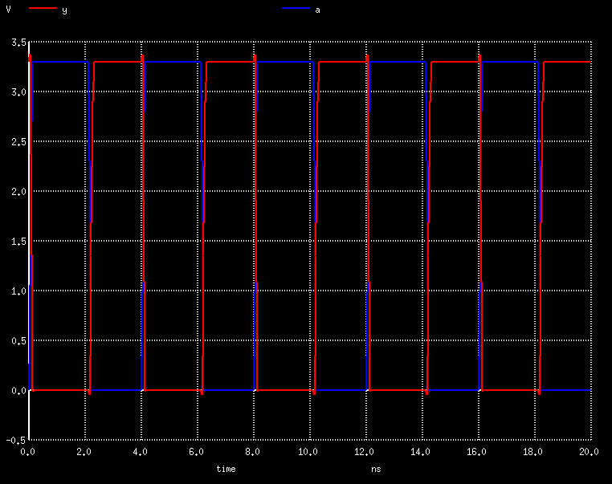

# Physical Design Workshop using OpenLane VSD

## Introduction to OpenLane
OpenLane is an automated RTL to GDSII flow based on several components including OpenROAD, Yosys, Magic, Netgen, CVC, SPEF-Extractor, CU-GR, Klayout and a number of custom scripts for design exploration and optimization. The flow performs full ASIC implementation steps from RTL all the way down to GDSII.

Installation, documentation and architecture of OpenLane can be found in following [OpenLane Github](https://github.com/The-OpenROAD-Project/OpenLane) link

### OpenLane detailed ASCI workflow 

OpenLane flow consists of several stages. All flow steps are to be run in sequence. Each stage may consist of multiple sub-stages.


### Open-source eda tools in OpenLane

OpenLane integrated several key open source tools over the execution stages 

```
    Synthesis
        yosys - Performs RTL synthesis
        abc - Performs technology mapping
        OpenSTA - Performs static timing analysis on the resulting netlist to generate timing reports
    Floorplan and PDN
        init_fp - Defines the core area for the macro as well as the rows (used for placement) and the tracks (used for routing)
        ioplacer - Places the macro input and output ports
        pdn - Generates the power distribution network
        tapcell - Inserts welltap and decap cells in the floorplan
    Placement
        RePLace - Performs global placement
        Resizer - Performs optional optimizations on the design
        OpenDP - Perfroms detailed placement to legalize the globally placed components
    CTS
        TritonCTS - Synthesizes the clock distribution network (the clock tree)
    Routing
        FastRoute - Performs global routing to generate a guide file for the detailed router
        CU-GR - Another option for performing global routing.
        TritonRoute - Performs detailed routing
        SPEF-Extractor - Performs SPEF extraction
    GDSII Generation
        Magic - Streams out the final GDSII layout file from the routed def
        Klayout - Streams out the final GDSII layout file from the routed def as a back-up
    Checks
        Magic - Performs DRC Checks & Antenna Checks
        Klayout - Performs DRC Checks
        Netgen - Performs LVS Checks
        CVC - Performs Circuit Validity Checks
```

### Directory structure

All output run data is placed by default under ./designs/design_name/runs. Each flow cycle will output a timestamp-marked folder containing the following file structure.

```
designs/<design_name>
├── config.tcl
├── runs
│   ├── <tag>
│   │   ├── config.tcl
│   │   ├── {logs, reports, tmp}
│   │   │   ├── cts
│   │   │   ├── signoff
│   │   │   ├── floorplan
│   │   │   ├── placement
│   │   │   ├── routing
│   │   │   └── synthesis
│   │   ├── results
│   │   │   ├── final
│   │   │   ├── cts
│   │   │   ├── signoff
│   │   │   ├── floorplan
│   │   │   ├── placement
│   │   │   ├── routing
│   │   │   └── synthesis

```

---

## ASIC design using OpenLane

### 1. Invoke OpenLane interactive and prepare design 

- `./flow.tcl -interactive` : invokes Openlane in interactive mode such that all flow steps can be run sequentially to see logs, results generated after each stage. 
 
- `package require openlane 0.9` : imports all OpenLane packages.

> 

- `prep -design <design_name>` : starts design preparation stage where tool creates merged LEF and configuration for OpenLane tools.
   - __runs/\<tag\>/config.tcl__ : contains all the inputs used in later stages of ASIC flow.
  
  Following are the outputs form design preparation stage.
> 

   
### 2. Synthesis
 
- `run_synthesis` : Synthesizes gate level netlist form HDL and does technology mapping. Invokes OpenSTA to do static timing analysis on synthesized netlist and generates timing reports.
  - __runs/\<tag\>/results/synthesis/\<design\>.synthesis.v__  : Gate level netlist after synthesis step.
        
  - __runs/\<tag\>/reports/synthesis/__ : contains reports form synthesis and timing reports form STA
        
> 
       
#### Flop ratio from synthesis report [1-yosys_4.stats.rpt]
- Number of DFF : 1613
- Number of cells : 14876
- Flop Ratio : 1613/14876 = 10.8%

### 3. Floorplanning    
- `run_floorplan` : defines core area for macros, rows, tracks and places macro io ports as well as tap/decap insertion. 
  - __runs/\<tag\>/results/floorplan/\<design\>.floorplan.def__ : DEF generated after floorplan stage
  - __runs/\<tag\>/reports/floorplan/__ : reports showing core and die area form floorplan stage
> 

#### View DEF from floorplan stage in Magic
- `magic -T <Technology file for magic> lef read <path to merged lef> def read <path to DEF after floorplan>`
> 


#### Core utilization 
- Area occupied by cells from synthesis report [*1-yosys_4.stats.rpt*] : 147,712.9184 um2
- Core area form floor plan stage report : 420,473.2672 um2
- Core utilization = 35.13%  [*as specified in PDK specific config.tcl*]

### 4. Placement

- `run_placement` : performs congestion aware (not timing aware) placement.
  - __Global placement__ uses HPWL concept (half parameter wire length) to achieve reduction of wire length in OpenLane.
  - __Detailed placement__ performs legalization i.e., placement of standard cells in rows and ensuring no overlaps.
  - __runs/\<tag\>/results/placement/\<design\>.placement.def__ : DEF generated after placement stage.

> 

#### View DEF from placement stage in Magic
- `magic -T <Technology file for magic> lef read <path to merged lef> def read <path to DEF after placement>`
> 

### 5. CTS
- `run_cts` : performs congestion aware (not timing aware) placement. generates def with clock tree buffers in cts results folder and and new verilog file in synthesis results folder
.
.
.
.

---

## Magice features and DRC cheks
Lab instance for DRC rules with Magic with sample layouts (.mag) are downloaded. The source file .magicrc present in labs folder (drc_tests) contains the local copy of tech file so we need not specify -T <tech file> while invoking magic. Since we might need to edit the tech file to add DRC checks, it s better to use local copy of tech file.
> 
> 

Invoke Magic with `magic -d XR` command for better graphics, load poly.mag to add missing DRC rules in tech file. 
`(poly.9) Poly resistor spacing to poly or spacing (no overlap) to diff/tap 0.480 µm`  

In layout, for poly.9 0.48 spacing is required. But npoly and poly are only 0.22 um apart and no violation is flagged.  

### Modification 1 :
We have to edit the tech file to add DRC check and redo DRC to see if it shows DRC violation.
> 
> 

After adding DRC check in tech file and redoing DRC, violation is flagged for spacing. (highlighted in yellow)
> 

### Modification 2 :

Since tech file only has violation of noplyres to ntap, DRC violation is not flagged between noplyres and pdiff
> 

Changed spacing rule between npres and *nsd to npres and alldiff.
> 

DRC violations after loading modified tech file.
> 


### DRC Rule styles 
Any edge based rule can be made with cif output operators but generating these layers is compute intensive. To keep Magic from being slowed down, its best to use simple DRC edge based rules whenever possilbe and keep cif output rules in separate variant of DRC as shown below.

> 

Here, DRC fast intended for checking BOEL layers till Metal layers. DRC full checks layers below metal layers as well (compute intensive)    
Switch between styles using `drc style drc(fast)`

### Identification of untapped nwell layers (nwell.4)

Creates a DRC rule for nwell unappted connections using cif operations in DRC full mode.
> 

1.Create temp layer nwell_tapped using bloat-all operation on nsc (ncontact) to fill any nwell underneath it.
> 

2.Remove all nwell_tapped geometries from nwell to identify nwells witout contacts
> 

When tech file reloaded, set drc style to full and performed DRC check, we can see DRC violation is flagged for nwell without contact (left) but on right no DRC violation is falgged since it has nwell contact (right).
> 


---


---

## Standard cell layout design in Magic
Creation of single height standard cell and plug this custom cell into a more complex design and perform it's PnR in the openlane flow. The standard cell chosen is a basic CMOS inverter and the design into which it's plugged into is a pre-built picorv32a core. Refer [Github link](https://github.com/nickson-jose/vsdstdcelldesign) for more details.

### Steps to extract spice netlist from layout
- `extract all` : to extract all data
- `ext2spice cthresh 0 rthresh 0` : to extract all parasitic R and C
- `ext2spice` : generates spice netlist [*<cell>.spice*] 

Use `box` command in tkcon of magice tool to find minimum grid size and correct scale, include libs and correct model name of device in netlist before performing spice simulations.

#### Lab
Git Clone std cell 
> 

Identification of layout as CMOS inverter
> 

Extract spice netlist from Layout
> 

Transient simulation of CMOS inverter
> 
> 

 ### LEF generation of std cell
 
Tracks.info file is present in pdk directory and these tracks will be used for routing. 
> 

Enable grid in magic using command `grid [xspacing [yspacing [xorigin yorigin]]]` in current scenario `grid 0.46um 0.34um 0.23um 0.17um`


Width of standard cell should be odd multiple of X pitch and Height of standard cell should be odd multiple of Y pitch.
Signal ports should be at the intersection of horizonatal and vertical tracks. Refer to `https://github.com/nickson-jose/vsdstdcelldesign` for LEF creation.

### * * * Use custom inverter cell into openlane flow * * *
1.Copy the LEF of inverter cell along with the lib files containg the characterized data for the custom cell in `<design>/src` folder.

2.Open `<design>/config.tcl` and set env variables for syntesis and timing libraries lib files from src folder and run synthesis again.

#### Intial steps
`./flow.tcl -interactive`

`prep -design <design_name>`

#### Synthesis
Before delay-area optimization following are the area and dealy stats for the design.
> 

Setup dealy-area optimization algorithms as follows without exiting the openlane flow. Refer to `openlane/configuration/README.md` for more details on env variables.

`% set ::env(SYNTH_STRATEGY) "DELAY 1"`

`% set ::env(SYNTH_BUFFERING) 1`

`% set ::env(SYNTH_SIZING) 1`

After delay-area optimization following are the area and dealy stats for the design.
> 


#### Floorplan

`run_floorplan` fails in new flow as below.
> 

#### Steps to complete flow without errors

```
init_floorplan
place_io
global_placement_or
detailed_placement
tap_decap_or
detailed_placement
gen_pdn
run_routing
```
> 

#### Optimize synthesis to reduce setup violations

A1. STA configuration file :  (Netlist: dealy 0 optimized synthesized verilog before synthesis optimization for setup violations)


A2. SDC file used for sta analysis


- Pickup base sdc file from default scripts area and set clock period and driving cell : `openlane/scripts/base.sdc`

Result A : 

Due to high fanouts, higher delays are observed


Modification 1 : Change the max_fanout using `set ::env(SYNTH_MAX_FANOUT) 4` and rerun the synthesis. Use this netlist to run sta again.


B1 : After executing multiple `replace_cell <instance_name> <lib_cellname>` in the path to get the wns less than - 1 ns and tns close to -10 ns. The timing path is as follows. (Tip: Identify and Replace high delay/high slew cauisng cells from the beginning of the path by increasing the drive of the cells to reduce wns and tns, Keep max_fanout to 4)


Overwrite the existing verilog file (generated from synthesis having high tns/wns) with current verilog file from sta(with less tns/wns).
`write_verilog <tag>/results/synthesis/<design>.synthesis.v`


In interactive shell, 
- `run_floorplan` which will take replaced netlist form synthesis area (have better tns/wns).
  - if floorplan fails, run `init_floorplan`, `place_io`,`global_placement_or`, `tap_decap_or` commands.
  
  
  
  
  
- `run_placement` 
  

- `run_cts` : after CTS stage, (a)new verilog file with cts data in `results/synthesis` folder is generated. (b)in `results/cts` folder def is generated.
  - Verify values of max cap, max slew and clock buffers used using commands from `openlane/scripts/openroad/or_cts.tcl` file.
    
    
    
- `openroad` : Invoke  openroad to do timing analysis to use existing env variables instead of defining in separating config file.
  - `read_lef` and `read_def` commands are used to read in merged.lef in tmp folder and <design>.cts.def in `results/cts` folder.
     
  - `write_db <design>.db` : to save the database and `read_db <design>.db` : to read in existing database.
  -  `read_verilog` : to read in verilog file form CTS stage in results/synthesis folder.
  -  `read_liberty` : To read in liberty files, -min : fast.lib ; -max : slow.lib
  -  `read_sdc` : Read in sdc file.
    

  - `report_checks -path_delay min_max -format full_clock_expanded -digits 4` : to report min max paths worst slacks.
    - Minpath : 
     
     
    - Maxpath : 
     
     
 - After cts in detailed routing , actual metal traces are being laid capacitances and resistances of these come into picture. so this should increase data arrival time, which wil help in improving hold violation

- We have used typical library for synthesis but for analysis we are using min, max libraries so analysis is not corret . We exit from openroad but not from openlane, invoke openroad and set typ lib and do analysis.
  
  -Min path : 
  
  -Max path : 
  
  


---
        
## 16 mask CMOS process
        
1. Mask 1 : Used for creation of Isolation between wells to protect active regions. SiO2->Si3N4->Mask over active region->Oxidation (LOCOS)->Etch Si3N4
  - Oxide not under Si3N4 grows more leading to formation of Bird's beak (isolation between wells)
2. Mask 2 & 3 : Used to shiled parts of substrate and do Ion implantation to create NWELL & PWELL, allow dopants to penetrate more into substrate by keeping in high temp furnace.
3. Mask 4 & 5 : Used to implant dopants into channel region alternatively in NWELL and PWELL. Etch damaged SiO2 (due to implantationa) and grow new SiO2. Deposit Poly and dope it for increased conductivity
4. Mask 6 : Used to create poly geomtries in the layout
5. Mask 7 & 8 : Used to create LDD (P+P-N & N+N-P) using Si3N4 anisotropic etching  spaces to create P- and N- regions of LDD profile. 
6. Mas 9 & 10 : Used to achieve P+ and N+ of LDD profile due to keeping Si3N4 side wall around gate. and do annealing to allow dopants penetrate more into substrate.
7. Mask 11 : Deposit Ar treated Ti as contacts and heat with N2 creating TiN local interconnects. Use mask 11 to etch away TiN in regions where contacts need not be brought to upper level.
8. Mask 12-16 : Deposit SiO2 and do CMP and use masks 12 to 16 created drilling contacts to local interconnects to form higher level routing.

---

END
